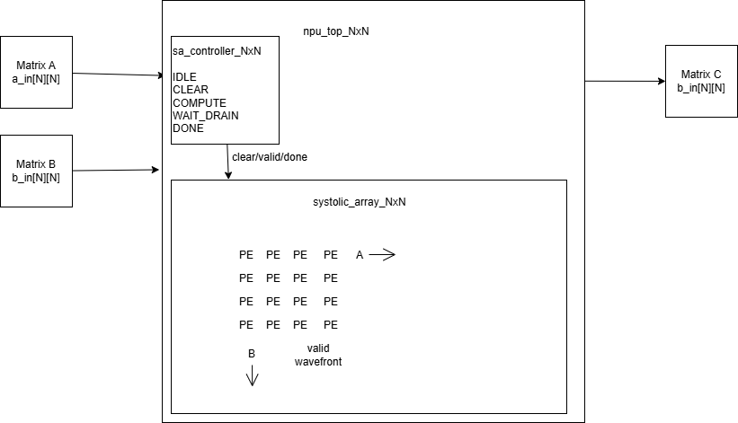

# NxN Systolic Array NPU Verification using UVM

## Table of Contents

- Overview
- Top Architecture
- Processing Element
- RTL Structure
- Verification Architecture
- Scoreboard and Golden Model
- SystemVerilog Assertions
- Functional Coverage
- Regression Results
- How to Run
- Future Work

## Overview

This project implements and verifies a parameterizable NxN Neural Processing Unit(NPU) based on a systolic array architecture for signed INT8 matrix multiplication.

The RTL design is developed in SystemVerilog and supports configurable array dimensions through parameterization.

A complete UVM verification environment is built to validate functionality, timing behavior, and data propagation across the systolic array.

Verification techniques used in this project include:
- Directed testing
- Constrained random testing 
- Golden model scb checking 
- SystemVerilog Assertions (SVA)
- Functional coverage
- Regression testing

Current regression status:
- 102/102 tests passed
- 0 UVM err
- 0 UVM fatals
- 100% in data coverage
- 100% matrix pattern coverage
- 100% out data coverage

## Top architecture


The design consists of 2 major RTL blocks:

Controller FSM
The controller manages the computation flow using five states:
- IDLE
- CLEAR
- COMPUTE
- WAIT_DRAIN
- DONE

NxN Systolic Array
- The systolic array is composed of NxN Processing Elements (PEs)
- Input matrix A propagates horizontally across the array
- input matrix B propagates vertically across the array
- A wavefront based valid signal propagates together with the operands to guarantee timing alignment

## Processing Element (PE)

Each PE is intentionally designed as a lightweight MAC cell.

Inputs:
- a_in
- b_in
- valid
- clear

Output:
- accumulated result

Operation priority:
- Reset
- Clear
- MAC operation
- Hold accumulated value

Operand forwarding is not implemented inside the PE

Data propagation and skew management are handled at the systolic array level

## RTL Structure

rtl/
|-- pe.sv
|
|-- systolic_arr_NxN.sv
|
|-- sa_controller_NxN.sv
|
|-- npu_top_NxN.sv

pe.sv

Implements signed Multiply Accumulate (MAC)functionality.

systolic_arr_NxN.sv

Implements operand skewing, valid propagation, and PE interconnection.

sa_controller_NxN.sv

Controls computation sequencing and latency management.

npu_top_NxN.sv

Top level integration of controller and systolic array.

## Verification Architecture


## Scoreboard and Golden Model

The verification environment uses a self_checking scoreboard

Input trans captured by the input monitor are used to gen expected matrix multiplication results through a golden reference model

Output trans captured by the output monitor are compared against the expected results

A trans is reported as PASS only when all matrix elements match the expected reference values

This approach enables automated regression testing without manual waveform inspection

## SystemVerilog Assertions

Implemented assertion categories:

### Processing Element (PE)

- Reset behavior
- Clear behavior
- Hold behavior
- MAC operation correctness

### Controller

- State transition checking
- Done pulse width checking
- Start-to-done latency checking

### Systolic Array

- Valid wavefront propagation
- Operand alignment checking
- No-X checking during valid operation

## Functional Coverage
Functional coverage is used to measure verification completeness and scenario exploration

Input data coverage

The following input categories are covered:
- Positive values
- Negative values
- Zero values
- Cross combinations between A and B operands

Matrix pattern coverage

Directed test pattern include:
- Zero Matrix
- Identity Matrix
- Random Matrix

Output data coverage

Output matrix elements are monitored and categorized into:
- Positive results
- Negative results
- Zero results

Coverage closure target:
- 100% input coverage
- 100% matrix pattern coverage
- 100% output coverage

## Regression Results

The verification environment was executed using both directed and constrained-random testing

Regression Summary:

Metric          Result 
Total Tests     102    
Directed Tests  2      
Random Tests    100    
Passed          102    
Failed          0      
UVM Errors      0      
UVM Fatals      0      

Coverage Summary:

Coverage Type            Result 
Input Data Coverage      100%   
Matrix Pattern Coverage  100%   
Output Data Coverage     100%   

## How to Run

### Run normal UVM regression
```tcl
do scripts/run_uvm.do
Expected result:
102/102 tests passed
0 UVM errors
0 UVM fatals

Functional coverage 100%

Run coverage closure
tcl
do scripts/run_cov.do
This flow runs:
- UVM normal regression
- RTL reset-abort coverage test
- UCDB coverage merge
Final coverage report generation

Expected coverage result:

Coverage Type	        Result
Statement Coverage	    100%
Branch Coverage	        100%
Condition Coverage	    100%
Expression Coverage	    100%
FSM State Coverage	    100%
FSM Transition Coverage	100%
Functional Coverage	    100%
```
## Future Work 

Future improvements include:

- AXI-Stream interface support
- DMA integration
- Advanced protocol assertions
- Coverage closure automation
- Regression infrastructure enhancement
- Formal verification exploration
- Reusable AI accelerator verification framework
Long-term goal: evolve this project into a reusable open-source verification platform for AI accelerator IPs