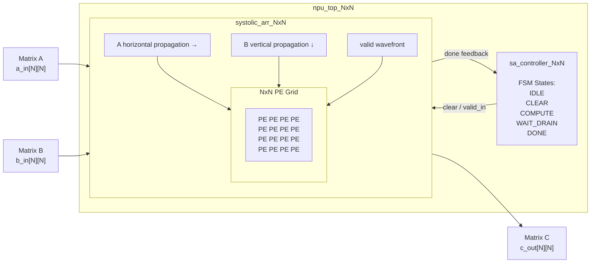

NxN Systolic Array NPU Verification using UVM
Overview
This project implements and verifies a parameterizable NxN Neural Processing Unit(NPU) based on a systolic array architecture for signed INT8 matrix multiplication.
The RTL design is developed inn SystemVerilog and supports configurable array dimesions through parameterization.
A complete UVM verification environment is built to validate functionality, timing behavior, and data propagation across the systolic array.
Verification techniques used in this project include:
- Directed testing
- Constrained random testing 
- Golden model scb checking 
- SystemVerilog Assertions (SVA)
- Functional coverage
- Regression testing
Current regression status:
- 102/102 tests passed
- 0 UVM err
- 0 UVM fatals
- 100% in data coverage
- 100% matrix pattern coverage
- 100% out data coverage
Top architecture
